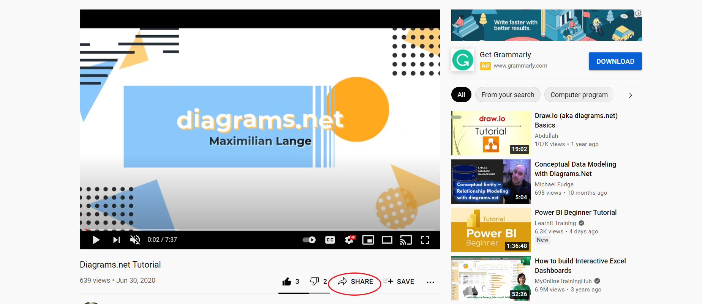
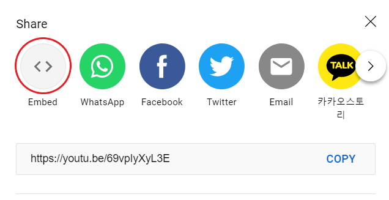
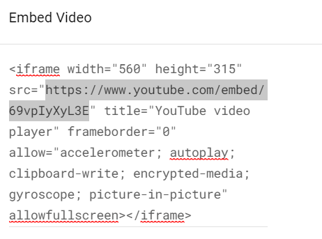
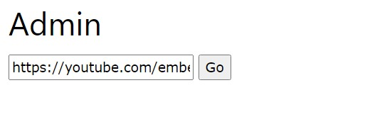
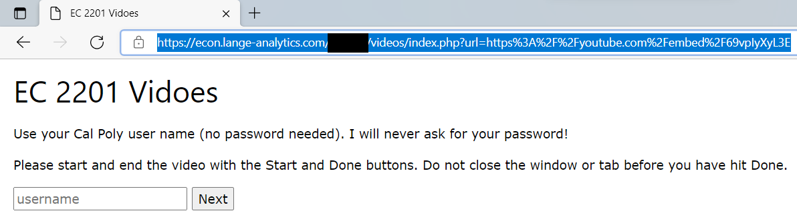

Admin
==========

Step 1: Go to your Video
**************************************

Go to your video and click the share button.

Step 2: Get your Video Link
**************************************

Click the embed button and copy the link that is in the code

Step 3: Enter your Link in the Admin Site
******************************************

.. note::

    For this step and the ones that follow, you site is required to be
    hosted.

    :ref:`Learn How <Hosting>`

Goto the url where your site is hosted and add admin.html and enter the URL
which you copied before.

Step 4: Get your URL
******************************************

Press go and copy the URL from the search bar.

Share your URL!

Step 5: Get the results
******************************************

Go to where your site is hosted and download log.cvs

It should look like this (One User Only):

.. code-block:: text

    test-user, 2021-03-20, 22:16, https://www.youtube.com/embed/69vpIyXyL3E, start
    test-user, 2021-03-20, 22:17, https://www.youtube.com/embed/69vpIyXyL3E, end

This user's username is "test-user". test-user watched from 22:16 (10:16 PM) to
22:17 (10:17 PM). The embedded video that test-user watched was
"https://www.youtube.com/embed/69vpIyXyL3E".