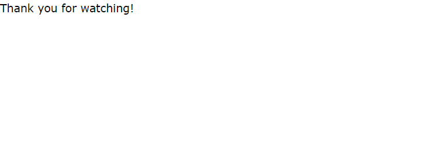

End/Thank You Page
===============================

This file is the last page where the visitors of you video portal will see. It
tells the visitors that they are done. It can also thank them for watching
(eg. Thanks for Watching).

To edit, Find the file "done.php". In the file find the comment "Start Custom".

.. code-block:: html
    :emphasize-lines: 1

    <!-- Start Custom -->

    <!-- End Custom -->

In between "Start Custom" and "End Custom" is where you can edit the
introduction/instruction text. You must write your text in HTML.
