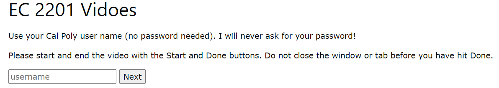

Introduction/Instruction text
===============================

This file is the first page where the visitors of you video portal will see. It
asks for the visitor's username (Not the password!!!). It also provides the
instructions how to use the tool.

To edit, Find the file "index.rst". In the file find the comment "Start Custom".

.. code-block:: python
    :empathise: 1

    <!-- Start Custom -->
    
Use your Cal Poly user name (no password needed). I will never ask for your password!

    
Please start and end the video with the Start and Done buttons. Do not close the window or tab before you have hit Done.

    <!-- End Custom -->